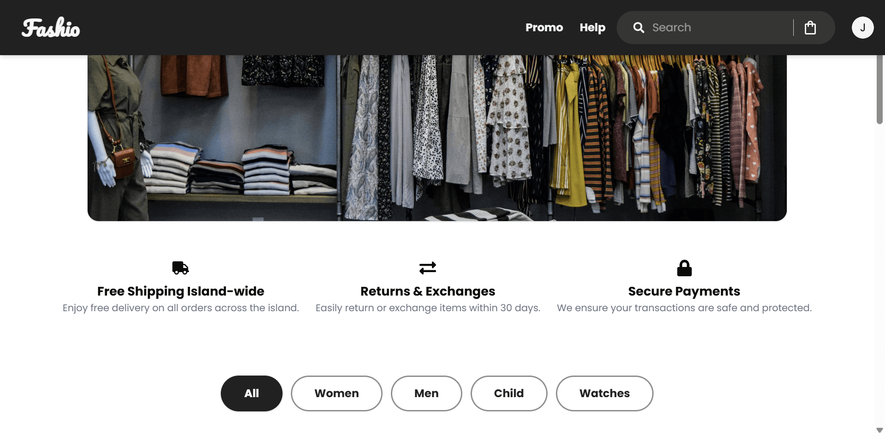
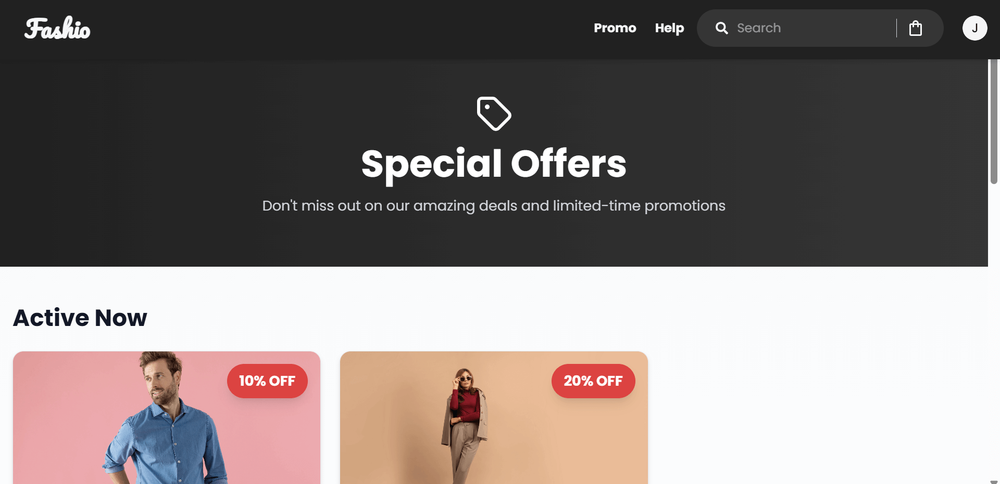
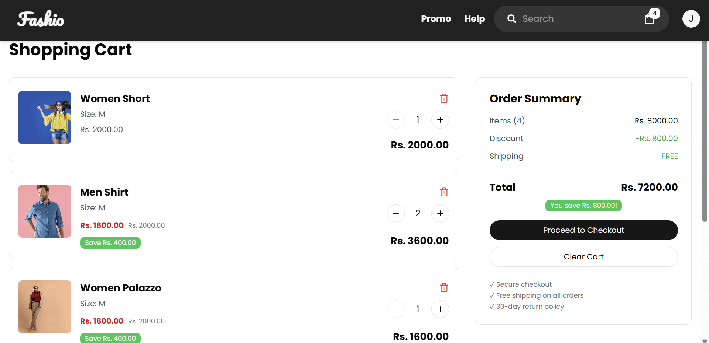
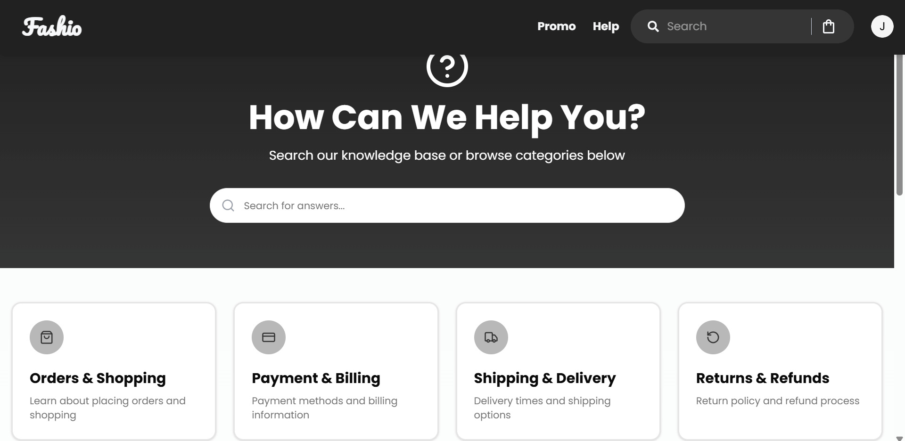
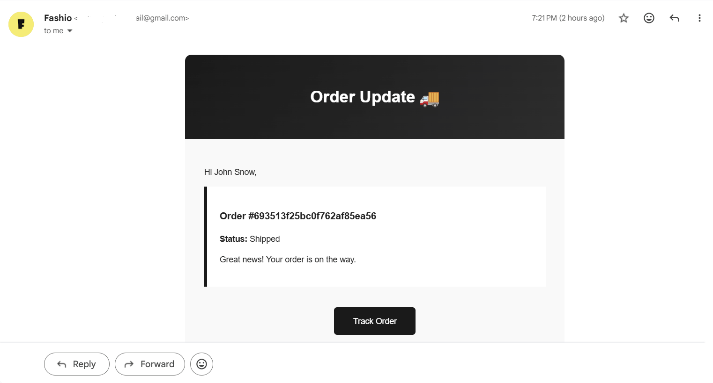
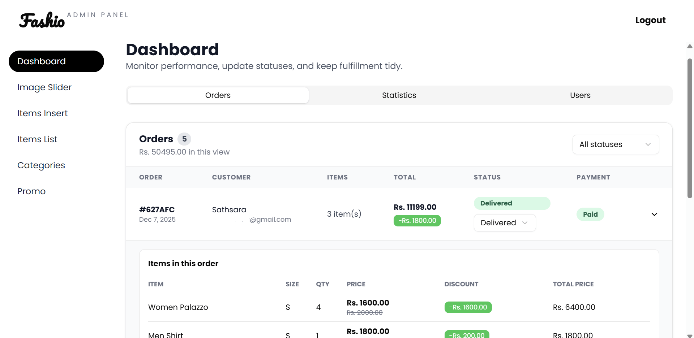
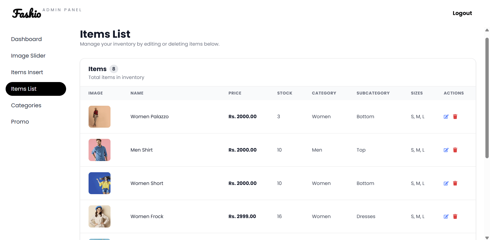
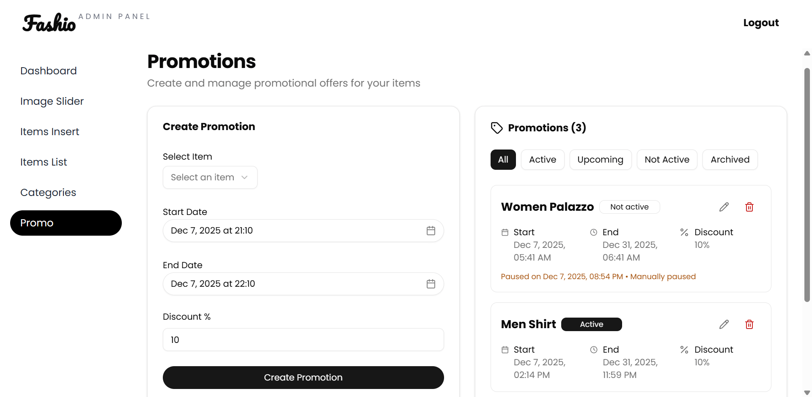
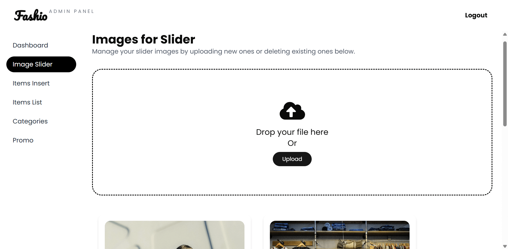

# Fashio Two - Modern E-Commerce Platform


A premium, full-stack fashion e-commerce application built with the MERN stack (MongoDB, Express, React, Node.js). Features a robust admin dashboard, AI-powered fashion assistant, secure authentication, and a dynamic user experience.

---

## ✨ Features

### 🛍️ Client Experience
*   **Modern Shopping**: Categories, search, filters, and dynamic promotional sliders.
*   **Cart & Checkout**: Full cart management with real-time stock validation and address management.
*   **Order Tracking**: Users can track order status (Pending, Shipping, Delivered) from their profile.
*   **User Accounts**: Secure login via Email/Password or **Google OAuth**, with email verification and password reset.
*   **Responsive Design**: Mobile-first interface with smooth Framer Motion animations.

### 🔐 Admin Dashboard
*   **Analytics**: View order statistics and platform health.
*   **Product Management**: CRUD operations for Items, Categories, and Promos.
*   **Order Fulfillment**: Manage customer orders and update shipping statuses.
*   **Media Management**: Upload and manage slider images and product photos.
*   **AI Product Generation**: Auto-generate product descriptions and content using Gemini AI.

### 🛡️ Security & Performance
*   **Security**: Helmet headers (CSP/CORP), Rate Limiting, and HttpOnly Cookies.
*   **Performance**: Gzip compression, lazy loading, and optimized assets.
*   **Session Management**: Persistent sessions using MongoDB Store (`connect-mongo`).

---

## 📸 Screenshots

### Client Interface
<div align="center">
  
  
</div>
<br/>
<div align="center">
  
  
</div>
<br/>
<div align="center">
  
</div>

### Admin Dashboard
<div align="center">
  
  
</div>
<br/>
<div align="center">
  
  
</div>
<br/>
<div align="center">
  
</div>

---

## 🛠️ Tech Stack

### **Frontend**
*   **Framework**: React 19 + TypeScript
*   **Build Tool**: Vite 7
*   **Styling**: Tailwind CSS v4, Lucide Icons
*   **State/Data**: React Query (TanStack), Context API
*   **Forms**: React Hook Form + Zod Validation
*   **UI Components**: Radix UI, Sonner (Toasts)

### **Backend**
*   **Runtime**: Node.js + Express.js
*   **Database**: MongoDB + Mongoose
*   **Auth**: Passport.js (Google OAuth), JWT, Argon2/Bcrypt
*   **AI**: Google Gemini SDK (`@google/genai`)
*   **Email**: Nodemailer
*   **Security**: Helmet, Express Rate Limit, CORS

---

## 🚀 Getting Started

### Prerequisites
*   Node.js (v18+)
*   MongoDB (Local or Atlas)
*   **pnpm** (Recommended package manager)

### 1. Clone & Install
```bash
git clone https://github.com/asathsara/Fashio-Two.git
cd fashio-two

# Install Backend
cd backend
pnpm install

# Install Frontend
cd ../frontend
pnpm install
```

### 2. Environment Variables
Create a `.env` file in **backend/**:
```env
PORT=5000
NODE_ENV=development
MONGODB_URI=mongodb://localhost:27017/fashio-two
FRONTEND_URL=http://localhost:5173

# Security
SESSION_SECRET=your_super_secret_session_key
JWT_SECRET=your_jwt_secret

# Auth (Google OAuth)
GOOGLE_CLIENT_ID=your_google_client_id
GOOGLE_CLIENT_SECRET=your_google_client_secret

# AI
GEMINI_API_KEY=your_gemini_api_key

# Email (Optional)
EMAIL_HOST=smtp.gmail.com
EMAIL_USER=your@email.com
EMAIL_PASS=your_app_password
```

Create a `.env` file in **frontend/**:
```env
VITE_API_BASE_URL=http://localhost:5000/api
```

### 3. Run Locally
**Backend:**
```bash
cd backend
pnpm dev
# Runs on http://localhost:5000
```

**Frontend:**
```bash
cd frontend
pnpm dev
# Runs on http://localhost:5173
```

---
120: 
121: ### 4. Run with Docker 🐳
122: 
123: You can run the entire stack (Frontend, Backend, and MongoDB) using Docker Compose.
124: 
125: ```bash
126: # Build and start the containers
127: docker-compose up --build
128: 
129: # To run in the background (detached mode)
130: docker-compose up -d
131: ```
132: 
133: *   **Frontend**: http://localhost
134: *   **Backend**: http://localhost:5000
135: *   **MongoDB**: exposed on port 27017
136: 
137: ---

## 📦 Deployment

### Production Checklist
1.  **Environment Variables**: Ensure all variables above are set in your cloud provider (Vercel, Render, etc.).
2.  **HTTPS**: Required for secure cookies (`sameSite: 'none'`).
3.  **Build**:
    *   Frontend: `pnpm build`
    *   Backend: `npm start` (Runs `node server.js`)

### Security Configuration
The backend is pre-configured with `helmet` for security.
*   **CSP/CORP**: Configured to allow cross-origin image loading (essential for frontend displaying backend images).
*   **Cookies**: Automatically switches to `Secure` + `SameSite: None` in production.

---

## 📁 Project Structure

```
fashio-two/
├── backend/
│   ├── modules/          # Feature-based architecture (auth, item, order, ai)
│   ├── config/           # DB, Passport, Logger config
│   ├── middleware/       # Auth, RateLimit, ErrorHandler
│   └── server.js         # Entry point
│
└── frontend/
    ├── src/
    │   ├── components/   # UI building blocks
    │   ├── pages/        # Route components (Admin & Client)
    │   ├── hooks/        # Custom React hooks
    │   ├── services/     # API integration (Axios)
    │   └── contexts/     # Global state
    └── vite.config.ts    # Build config
```

---

## 🤝 Contributing

1.  Fork the repo
2.  Create your feature branch (`git checkout -b feature/NewFeature`)
3.  Commit changes (`git commit -m 'Add NewFeature'`)
4.  Push to branch (`git push origin feature/NewFeature`)
5.  Open a Pull Request

---

**Made with ❤️ by the Fashio Team**
